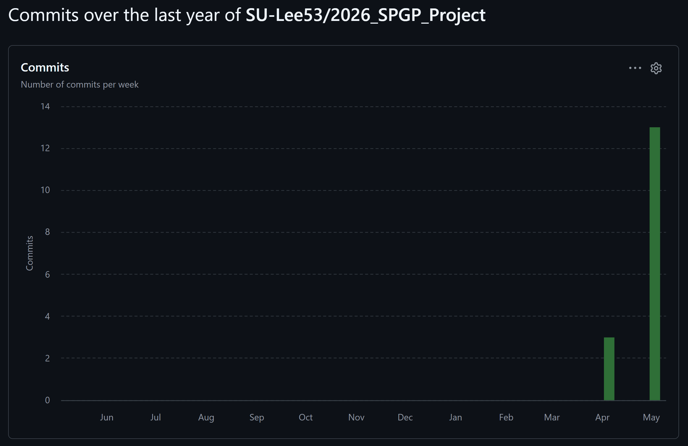

## 게임 소개

- `Hill Climb Racing` 방식의 2D 횡스크롤 언덕 주행 게임
- 차량을 조작하여 연료가 떨어지거나 뒤집히기 전까지 최대한 멀리 주행하는 것이 목표
- 실제 게임과는 컨텐츠 양과 퀄리티 측면에서 차이가 있음

## 개발 계획 / 일정 / 실제 진행

### 개발 진척도

| 항목 | 계획 | 실제 진행 |
| --- | --- | --- |
| 플레이어 차량 | 차량 이동, 가속, 감속, 회전 | 완료 |
| 랜덤 언덕 지형 | 무한 진행 가능한 지형 생성 | 완료 |
| 연료 시스템 | 연료 소모, 아이템 획득, 회복 | 완료 |
| Scene 구성 | 시작, 플레이, 종료 화면 | 완료 |
| 추가 Scene | 필요 시 일시정지 화면 | Pause Scene 추가 구현 |
| UI / HUD | 거리, 연료, 최고 기록 표시 | 완료 |
| 차량 물리 | 중력, 회전, 서스펜션 | 완료 |
| 충돌 판정 | 바퀴 / 차체 / 지형 충돌 | 완료, 일부 어색한 보정 남음 |
| 그래픽 리소스 | 배경, 차량, 버튼, 로고 | 완료 |
| 사운드 | 효과음, 배경음 | 미구현 |

### 주차별 커밋 횟수

| 주차 | Commits | 주요 진행 |
| --- | --- | --- |
| 1 (04.06~04.12) | 3 | 초기 프로젝트 준비 |
| 2 (04.13~04.19) | 0 | X |
| 3 (04.20~04.26) | 0 | X |
| 4 (04.27~05.03) | 19 | a2dg 적용, Scene / 차량 / 지형 / 연료 / 서스펜션 구현 |
| 5 (05.04~05.10) | 0 | X |
| 6 (05.11~05.17) | 0 | X |
| 7 (05.18~05.24) | 0 | X |
| 8 (05.25~05.31) | 0 | X |
| 9 (06.01~06.07) | 3 | HUD 보강, 난이도 조정 |
| 10 (06.08~06.14) | 4 | 배경, 로고, 이미지 버튼, 충돌 보정, 게임오버 화면 정리 |
- 일~월 단위의 github insight 를 월~일 단위로 변경한 표

### 목표 변경 사항

- 개발 후반부 부족한 시간을 조작감과 충돌 판정 안정화에 집중
- 이때문에 사운드 추가가 미구현됨
- 후반에는 새 기능 추가보다 차량 조작감과 충돌 판정 안정화에 집중함
- 사운드와 추가 스테이지는 시간상 제외하였다.

## 구현 내용

### 사용된 기술

- Kotlin / a2dg

### 참고한 것들

- `Hill Climb Racing`의 기본 플레이 구조
- 기타 오프로드가 가능한 레이싱 게임
- 차량 물리 구현을 위한 자료들 (AI를 이용하여 수집)

### 수업 내용에서 차용한 것

- SharedPreference
- 이미지 버튼
- GameObject와 World 구조

### 직접 개발한 것

- `Player`
    - 차량 이동, 가속 / 감속, 중력, 회전, 서스펜션, 전복 판정
- `HillTerrain`
    - 무한 랜덤 언덕 지형 생성, 경사도 계산, 카메라 스크롤 대응
- `FuelItemManager`
    - 연료 아이템 생성, 지형 위 배치, 충돌 검사, 연료 회복
- `GameHud`
    - 거리, 연료, 최고 기록 표시
- `GameProgress`
    - 최고 기록 저장 및 갱신

## 아쉬운 점

### 하고 싶었지만 못 한 것

- 효과음과 배경음 추가
- 다양한 차량 추가
- 다양한 배경 선택
- 더 긴 플레이 테스트를 통한 난이도 조정

### 스토어에 판매한다면 보충할 것

- 사운드 옵션
- 조작 튜토리얼
- 차량 업그레이드 시스템
- 여러 배경 테마
- 업적 / 랭킹

### 해결하지 못한 문제 / 버그

- 급경사에서 차체가 지형에 닿을 때 보정이 약간 어색한 순간이 존재함
- 차량 물리는 게임 플레이가 가능한 수준이지만 실제 물리처럼 자연스럽지는 않음
- 연료 등장 간격과 난이도 상승 곡선은 더 많은 테스트가 필요

### 프로젝트 중 어려웠던 점

- 바퀴 접지, 차체 충돌, 전복 판정이 서로 영향을 줘서 차량 물리 튜닝이 다소 난해했음

## 수업에 대한 내용

### 기대한 것

- OpenGL 등의 그래픽스 Api 혹은 게임 엔진을 이용한 안드로이드 게임 개발

### 얻은 것

- Android 프로젝트 구조
- Kotlin 이라는 새로운 언어에 대한 경험
- 개발중 겪는 다양한 문제와 해결방안 도입절차
- 다양한 디자인 패턴

### 얻지 못한 것
- 처음 수업에서 기대했던 것들

### 더 좋은 수업이 되기 위한 제안

- Kotlin 과 안드로이드 개발이 모두 처음인 수강생이 많을것 같음
- 여기에 주요 커밋의 코드만 보며 수업을 듣는 것은 개인적으로 기억에 오래 남지 않았음
- 더 좋은 수업을 위해서는 함께 코드를 작성해보는 비중이 늘면 더 좋을것 같음
