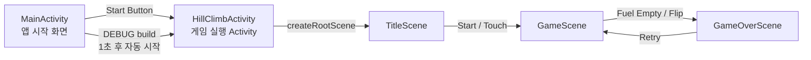
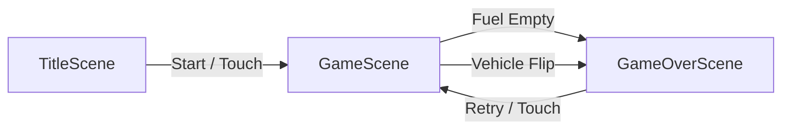
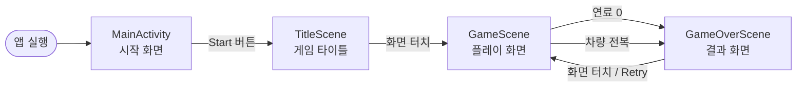
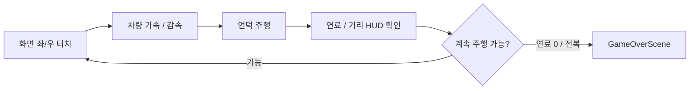

# 중간발표

## 게임소개

- 2D 횡스크롤 언덕 주행 게임
- 차량을 조작하여 울퉁불퉁한 언덕 지형을 주어진 연료로 최대한 멀리 주행하는 것을 목표로 함
- 차량이 뒤집히거나 연료를 모두 소모하면 게임 종료

## 진행상황

- [x]  플레이어 차량 → 100%
- [x]  무한 진행을 위한 언덕 지형 생성 시스템 → 100%
- [x]  수집 아이템 (연료) → 100%
- [ ]  3개의 Scene (시작, 플레이, 종료) → 80% (UI 디자인 약간 더 개선 필요)
- [ ]  UI 요소 → 50%
    - [ ]  연료 표시  → 80% (UI 디자인 약간 더 개선 필요)
    - [ ]  거리 표시 → 80% (UI 디자인 약간 더 개선 필요)
    - [ ]  최고 기록 표시 → 0%
- [ ]  배경 레이어 2종 → 50%
    - [ ]  뒷배경 → 50% (하늘색 단색 사용중)
    - [ ]  언덕 지형 → 50% (초록색 단색 사용중)
- [ ]  충돌 판정 → 90% (약간 버그 존재)
    - [ ]  바퀴, 차량 ↔ 언덕 지형 → 90% (지면에 차량 앞/뒤 접촉시 처리가 약간 어색)
    - [ ]  차량 전복 판정 → 90% (가끔 땅에 닿기 전에 사망판정됨)
- [ ]  중력과 간단한 차량 물리 → 96%
    - [x]  속도 변화 → 100%
    - [x]  회전 → 100%
    - [ ]  간단한 서스펜션 효과 → 90% (약간 버그 존재)

## Commit 진행 내역
- 

| 주차 | Commits |
| --- | --- |
| 4월 2주차 (04.05 ~ 04.11) | 3 |
| 4월 3주차 (04.12 ~ 04.17) | 0 |
| 4월 4주차 (04.18 ~ 04.25) | 0 |
| 5월 1주차 (04.26 ~ 05.02) | 0 |
| 5월 2주차 (05.03 ~ 05.09) | 13 |

## Activity 구성

## Scene 구성 및 전환 관계

- TitleScene
    - 게임 시작
    - 게임 제목과 시작 안내를 표시하고, 터치 입력을 받으면 GameScene으로 전환
- GameScene
    - 게임 플레이 Scene
    - 랜덤 지형, Player, 연료 아이템, HUD, 입력 처리를 포함
- GameOverScene
    - 게임 종료
    - 주행 거리와 최고 기록을 표시하고, 다시 시작 입력을 받으면 GameOverScene으로 전환

## GameObject 구성

### Player

- Class 구성 정보
    - 차량의 월드 위치, 속도, 수직 속도, 회전, 연료, 거리, 접지 상태를 관리
    - 차량은 차체 이미지와 앞/뒤 바퀴 이미지로 분리됨
        - 바퀴는 서스펜션 길이에 따라 차체 아래에서 별도로 그려짐
- 상호작용 정보
    - HillTerrain으로부터 현재 바퀴 위치의 지면 높이를 받아옴
    - FuelItemManager가 연료 아이템과의 충돌을 검사할 때 Player의 충돌 영역을 사용
    - GameScene은 Player의 isDead 상태를 확인하여 GameOverScene으로 전환
    - 좌우 터치 입력에 따라 isAccelerating, isBraking 값이 변경됨
- 핵심 코드 설명
    - updateHorizontalMovement()
        - 가속, 감속, 마찰, 최고 속도를 처리
    - updateVerticalMovement()
        - 중력과 수직 속도를 적용
    - resolveWheelGroundContact()
        - 앞/뒤 바퀴가 지형에 닿았는지 검사하고 서스펜션 힘을 적용
    - applyAirRotationControl()
        - 공중에서 가속/브레이크 입력으로 차량 자세를 제어
    - resolveBodyTerrainCollision()
        - 차체가 지형에 파고들었을 때 속도 감소, 위치 보정, 전복 판정을 처리

### HillTerrain

- Class 구성 정보
    - 무한히 이어지는 랜덤 언덕 지형을 생성하고 그림
    - 지형은 여러 개의 점으로 구성되며, 각 점 사이를 보간하여 부드러운 언덕 형태를 만듬
- 상호작용 정보
    - Player 가 바퀴 접지와 기울기 계산을 위해 getGroundY(), getSlopeAngle() 을 호출
    - FuelItemManager 가 연료 아이템을 지형 위에 배치하기 위해 getGroundY() 를 호출
    - GameScene 에서 cameraX 값을 전달받아 스크롤 위치에 맞춰 지형을 그림
- 핵심 코드 설명
    - ensurePointsUntil()
        - 카메라 앞쪽에 필요한 거리만큼 지형 점을 미리 생성
    - removeOldPoints()
        - 화면 뒤쪽으로 지나간 오래된 지형 점을 제거
    - getGroundY(worldX)
        - 특정 월드 x 위치에서의 지형 y 좌표를 반환
    - getSlopeAngle(worldX)
        - 특정 위치의 지형 기울기를 계산하여 차량 회전에 사용

### FuelItemManager / FuelItem

- Class 구성 정보
    - 플레이어가 획득할 수 있는 연료 아이템
    - FuelItemManager 는 여러 개의 FuelItem을 생성, 업데이트, 충돌 검사, 제거를 수행함
- 상호작용 정보
    - HillTerrain 의 지면 높이를 이용해 연료 아이템을 지형 위에 배치
    - Player 와 FuelItem 의 충돌 영역이 겹치면 연료를 회복
    - 획득한 아이템이나 지나간 아이템 제거
- 핵심 코드 설명
    - spawnItemsAhead()
        - Player 앞쪽 일정 거리까지 연료 아이템을 랜덤하게 생성
    - checkCollision()
        - Player와 FuelItem의 RectF 충돌을 검사한다.
    - removeOldItems()
        - 이미 획득했거나 화면 뒤로 지나간 아이템을 제거한다.

### GameHud

- Class 구성 정보
    - 게임 진행 중 필요한 정보를 화면에 표시하는 UI 객체
- 상호작용 정보
    - Player 의 거리와 연료 값을 읽어서 화면에 표시
- 핵심 코드 설명
    - draw()
        - 현재 거리, 연료량, 조작 안내를 화면에 출력

## UX

