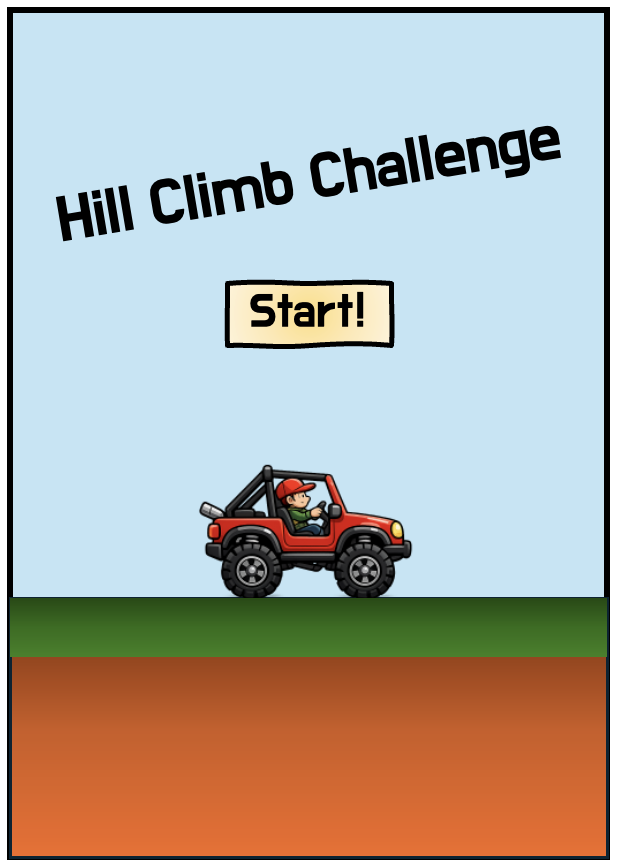
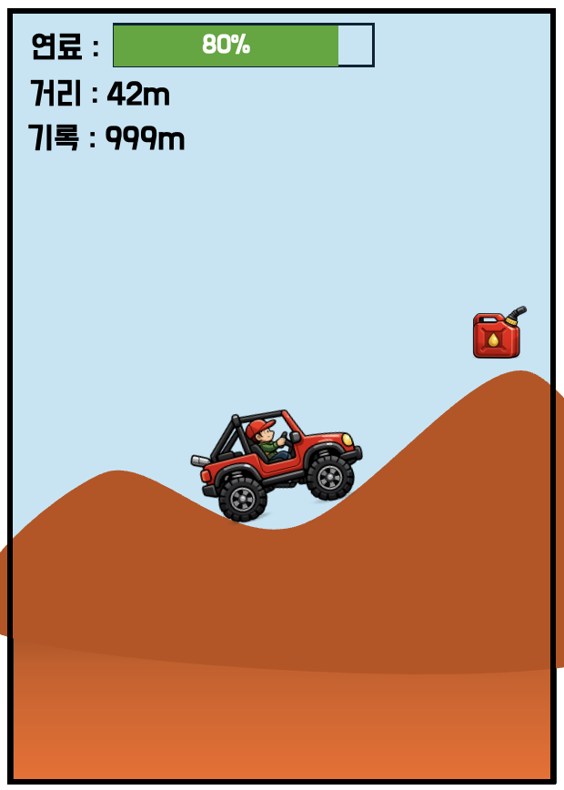
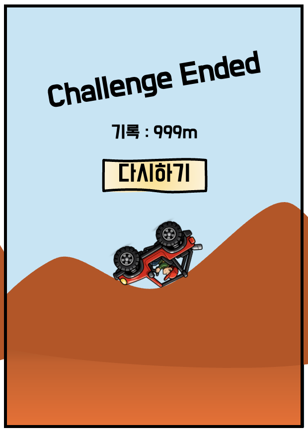

# Hill Climb Challenge

## 게임 컨셉

### High Concept

* 2D 횡스크롤 언덕 주행 게임
* 차량을 조작하여 울퉁불퉁한 언덕 지형을 주어진 연료로 최대한 멀리 주행하는 것을 목표로 함
* 차량이 뒤집히거나 연료를 모두 소모하면 게임 종료

### 핵심 메카닉

* 좌우 화면 터치로 차량 가속/감속 및 자세 제어
* 간단한 중력과 차량 서스펜션 물리
* 무한하게 연결된 랜덤한 언덕길을 무한으로 생성
* 연료 시스템
    - 차량이 가속하면 연료 소모
    - 아이템으로 연료를 재충전
    - 연료가 전부 소모되면 게임 종료

## 개발 범위

### 주요 개발 요소

* 플레이어 차량
* 무한 진행을 위한 언덕 지형 생성 시스템
* 수집 아이템 (연료)
* 3개의 Scene (시작, 플레이, 종료)
* UI 요소
    - 연료 표시
    - 거리 표시
    - 최고 기록 표시
* 배경 레이어 2종
    - 뒷배경, 언덕 지형
* 충돌 판정
    - 바퀴, 차량 ↔ 언덕 지형
    - 차량 전복 판정
* 중력과 간단한 차량 물리
    - 속도 변화
    - 회전
    - 간단한 서스펜션 효과

## 예상 게임 실행 흐름

* 게임 시작
    * Start 버튼을 눌러 게임이 시작
    * 
* 인게임
    * 오른쪽 터치 : 가속
    * 왼쪽 터치 : 감속
    * 연료가 떨어지거나 차량이 뒤집어지면 게임 오버
    * 
* 게임 종료
    * 방금 전 플레이의 기록을 표시
    * 다시하기 버튼을 눌러 재시작함
    * 

## 개발 일정

* 1주차
    - 리소스 수집, 기본 화면 layout 구성, Scene 전환
* 2주차
    - 플레이어 차량 , UI 표시, 입력 처리
* 3주차
    - 차량 이동, 중력, 지형생성, 스크롤 배경
* 4주차
    - 서스펜션, 회전 등의 차량 물리, 충돌처리
* 5주차
    - 아이템(연료) 추가, 거리 계산 시스템
* 6주차
    - 연료 게이지 View 등의 UI 보강
* 7주차
    - 전체 디버깅 시작
    - 지형 생성 및 차량 물리 디테일 보강
* 8주차
    - 디버깅 및 마무리